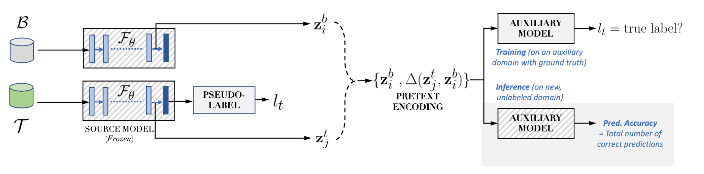

# DeltaUQ for Generalization Gap Prediction in Deep Models

Codes for [`Predicting the Generalization Gap in Deep Models using Anchoring`](https://ieeexplore.ieee.org/document/9747136), ICASSP 2022.

Refer to the diagram below for a summary of our approach


## Dependencies
This codebase was developed and tested using

+ matplotlib `3.4.3`
+ numpy `1.20.3`
+ scikit_learn `1.1.3`
+ torch `1.12.0`

## Downloading PACS Dataset
[Click here](https://drive.google.com/drive/folders/10rzi4KRQVTl34bm70K2Mrhd04zm1I2IM?usp=sharing) to download the PACS dataset. Extract the .tar file in `./data`

## 1. Training the primary classifier
To train the primary classifier on a source domain from PACS

```
python train_classifier.py --source_domain photo
```

## 2. Training the Decoder and Binary Classifier
To train the decoder and binary classifier 

```
python calibration.py --source_domain photo --calibration_domain sketch
```

NOTE: For training the decoder and binary classifier, you must have a primary classifier trained on the same source domain

## 3. Predicting Generalization on Target Domains
To obtain the estimate of accuracy on a target domain 

```
python inference.py --source_domain photo --target_domain art_painting --threshold 0.6
```

## Pre-trained Checkpoints for Reproducibility
[Click here](https://drive.google.com/drive/folders/10rzi4KRQVTl34bm70K2Mrhd04zm1I2IM?usp=sharing) to download the Resnet-18 primary classifier trained on Photos, decoder and binary classifier trained on Photo (source) and Sketch (calibration). Directly run Step 3 with the pre-trained checkpoints.

NOTE: The drive link maintains the same directory structure followed in all experiments

## Citations

Our paper can be cited as:

```
@INPROCEEDINGS{narayanaspg,
  author={Narayanaswamy, Vivek and Anirudh, Rushil and Kim, Irene and Mubarka, Yamen and Spanias, Andreas and Thiagarajan, Jayaraman J.},
  booktitle={ICASSP 2022 - 2022 IEEE International Conference on Acoustics, Speech and Signal Processing (ICASSP)},
  title={Predicting the Generalization Gap in Deep Models using Anchoring},
  year={2022},
  volume={},
  number={},
  pages={4393-4397},
  doi={10.1109/ICASSP43922.2022.9747136}}
```

